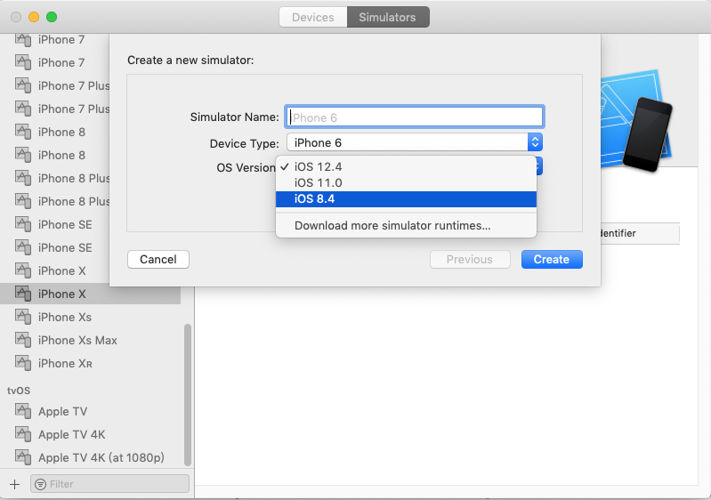

# Xcode-Simulator-Runtimes
lower simulator runtimes for higher version Xcode

## Usage

1、Download lower simulator runtimes and put them in directory:
`/Library/Developer/CoreSimulator/Profiles/Runtimes/`

2、Restart Xcode


## Git LFS
```
$ git lfs install
Updated git hooks.
Git LFS initialized.

$ git lfs track "*.zip"
Tracking "*.zip"

$ git add .gitattributes

$ git add iOS\ 8.4.simruntime.zip

$ git lfs status
On branch master
Git LFS objects to be pushed to origin/master:


Git LFS objects to be committed:

iOS 8.4.simruntime.zip (LFS: 5d1f777)

Git LFS objects not staged for commit:

README.md (Git: c5f5a5d -> File: 685223c)

$ git add README.md 

$ git commit -m 'add .zip for iOS8.4 Simulator runtime'
[master 782ddc8] add .zip for iOS8.4 Simulator runtime
2 files changed, 4 insertions(+), 1 deletion(-)
create mode 100644 iOS 8.4.simruntime.zip

$ git push origin master

$ git lfs ls-files
5d1f77796b * iOS 8.4.simruntime.zip

$ git lfs pull

$ git lfs fetch --all
fetch: 1 object(s) found, done                                                                                                     
fetch: Fetching all references...
```
